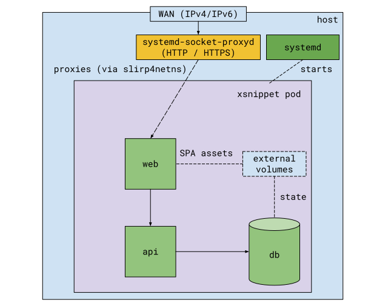

All-in-one instance of XSnippet
===============================

This playbook configures an "all-in-one" instance of XSnippet on a single Ubuntu/Debian host. It will:

* install and configure nftables to only allow incoming requests on 22 (SSH), 80 (HTTP), 443 (HTTPS) TCP ports
* install and configure "rootless" Podman with cgroups v2
* create a non-privileged user `xsnippet`
* create and start Podman containers for the XSnippet services and their dependencies



The configured XSnippet instance has the following components:

* `xsnippet-api` (https://github.com/xsnippet/xsnippet-api): API backend
* `xsnippet-db`: database that stores the persistent state (currently, PostgreSQL)
* `xsnippet-web` (https://github.com/xsnippet/xsnippet-web): web server (nginx) hosting the frontend
  implementation. Also acts as a reverse-proxy for the API

All services are run as Podman containers and are in the same "pod", i.e. they share user, pid, and
network namespaces. The containers are started in the "rootless" mode on behalf of user `xsnippet`.
The pod will be automatically started by the user instance of systemd on every machine boot.

The services running in the pod are isolated from the host network. Podman uses slirp4netns to bind
network ports on the host that will proxy incomming HTTP/HTTPS traffic to the pod network namespace.
Because slirp4netns runs as a non-privileged user, it can't bind to ports < 1024, so another level
of indirection is required: systemd listens on 80/443 and proxies the traffic to slirp4netns's ports
by the means of systemd-socket-proxyd.

Usage
=====

```shell
$ ansible-playbook -i path_to_inventory site.yml
```

Variables
=========

| Name                          | Description                                           |
| ----------------------------- | ----------------------------------------------------- |
| `xsnippet_api_server_name`    | server name (aka, virtual host) of the backend API    |
| `xsnippet_spa_server_name`    | server name (aka, virtual host) of the frontent SPA   |
| `xsnippet_api_image`          | Docker image of xsnippet-api to be used               |
| `xsnippet_db_image`           | Docker image of xsnippet-db to be used                |
| `xsnippet_db_external_volume` | Disk that should be used for storing the DB state     |
| `xsnippet_web_image`          | Docker image of xsnippet-web to be used               |
| `xsnippet_web_assets`         | URL of the SPA tarball release to be used             |
| `xsnippet_api_https_enabled`  | secure backend API with TLS (via let's encrypt)       |
| `xsnippet_spa_https_enabled`  | secure frontend SPA with TLS (via let's encrypt)      |
| `digitalocean_token`          | digitalocean token used by let's encrypt challenge    |
